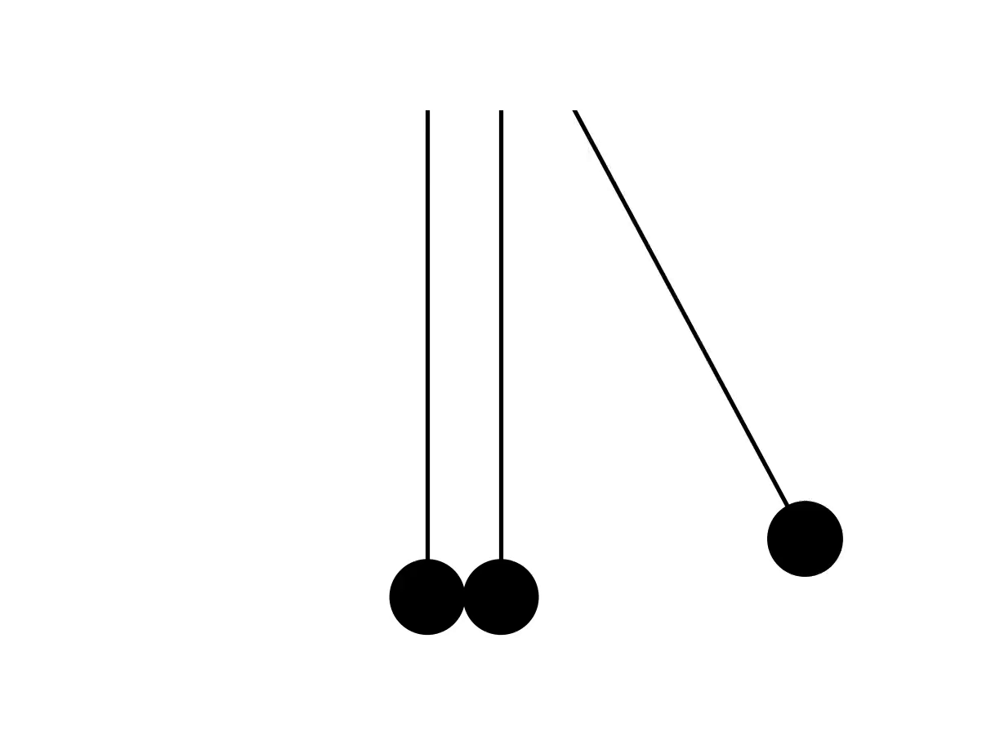
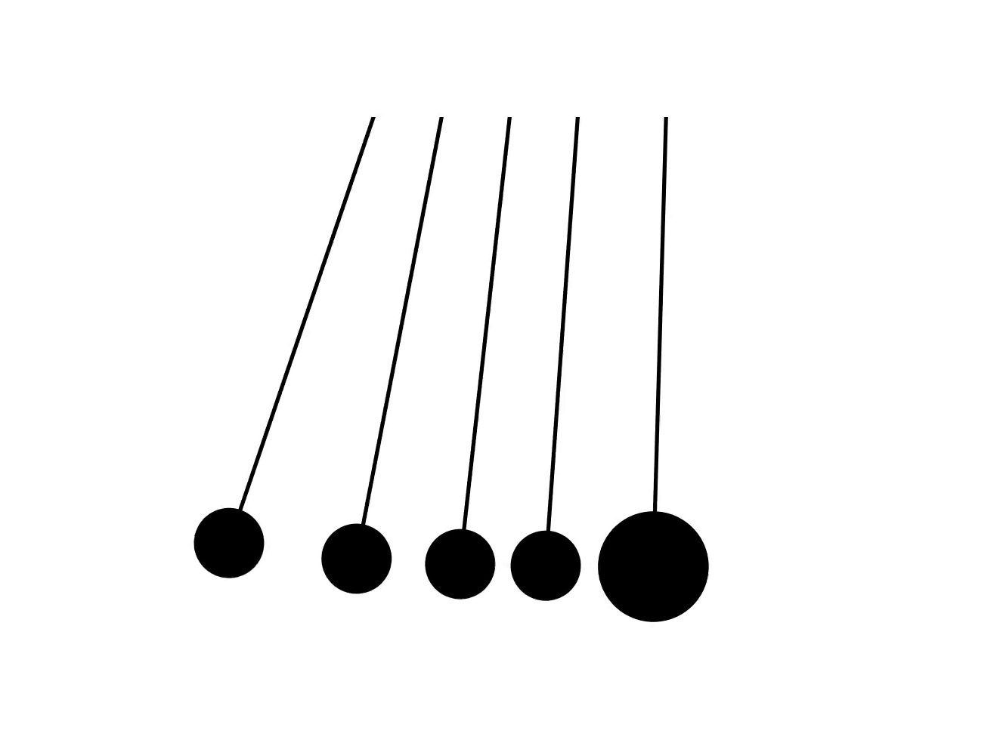

---
header-includes:
   - \usepackage[margin=1in, headheight=0pt, headsep=0pt]{geometry}
   - \usepackage{hyperref} 
   - \usepackage{xcolor}
title: Animating Newton's Cradle
author: Lachlan Macartney
---

# 1 Aim

The purpose of this project is to animate Newton's Cradle from first principles. Newton's Cradle has been animated before however typically via a key-frame method or one reliant on a complicated physics engine. This project will demonstrate how strikingly real world behavior can be computed with a simple, first-principles approach mathematical framework. Our elementary model will predict how the system's behavior changes when varying numbers of pendulums are raised. Additionally, it will provide insight on how a real cradle works and offer an explanation for some of the more curious non-ideal behavior.

# 2 Method

``Newton's Cradle can be modelled as multiple pendulums confined to swing along a single axis which undergo elastic collisions with one another. The pendulums rest such that there is a small amount of horizontal displacement between them.''

## 2.1 Fundamental Framework
This framework was implemented in python and the following graphics generated with the matplotlib python package. 

We will define the mathematics required for a generalised set of $n$ independent pendulums, then compute their interactions in a cartesian coordinate system $(x,y)$ which we will call the Cradle's Frame. For each $i \in \{1, 2, 3, ... , n\}$ let the $i$th pendulum have length $\ell$, radius $r_i$ and mass $m_i$. It will also need some displacement $\Delta x_i$ along the $x$-axis, so that it 'almost touches' the others at rest. Each pendulum has a single degree of freedom along the axis $(\theta_i)$ in its own reference frame which obeys the differential equation of a pendulum;

$$\ddot{\theta_i} = -\frac{g}{\ell}\sin(\theta_i)$$

A transform to the Cradle's Frame can be computed by; 

$$T(\theta_i, \Delta x_{i}) = (\ell\sin(\theta_i) + \Delta x_i, -\ell\cos(\theta_i))$$

We will say that a collision occurs if for any two pendulums $i, j$;

$$ |T(\theta_i, \Delta x_{i}) - T(\theta_j, \Delta x_{j})| = r_i + r_j$$

If we say that such a collision is elastic, from first principles we will arrive at;

$$\dot{\theta}_{i,\textrm{final}} = \frac{m_i-m_j}{m_i+m_j} \dot{\theta}_{i,\textrm{initial}} + \frac{2m_j}{m_i+m_j} \dot{\theta}_{j, \textrm{initial}} \quad \textrm{and} \quad \dot{\theta}_{j,\textrm{final}} = \frac{2m_i}{m_i+m_j} \dot{\theta}_{i,\textrm{initial}} + \frac{m_j-m_i}{m_i+m_j} \dot{\theta}_{j, \textrm{initial}}$$

We may also add the condition that each pendulum mass has the same density $\rho$ such that $m_i$ and $r_i$ are related via $m_i=\frac{4\pi\rho}{3}r_i^3$. For the traditional Newton's Cradle with equal mass and radii pendulums the above collision formulae simplify. However, such a non traditional cradle will be explored.

# 3 Results

\href{https://lachstr.github.io/physics_animations/misc/2020/05/29/newtons-cradle-animation.html}{\textcolor{blue}{Click here to view the results discussed. (Same title names)}}

## 3.1 Traditional pendulum
The simulations for five pendulums reflect the same results seen with a real Newton’s Cradle.

## 3.2 Middle pendulum motion
One of the most striking results of this simulation is we have recreated the effect where the middle balls begin to move after some time. The same phenomena can be seen in the video of a real cradle at the link above.

{ width=50% }

The explanation I can come up with for this originates from what we meant by the separation between pendulums being small.

Our simulation will aid us in arriving at an explanation. We can place the pendulums closer together, observe how this increases the time before the motion of the middle masses becomes obvious.

Define the $\theta = 0$ position for a pendulum to have zero gravitational potential energy. If one or more pendulums collide with a positive gravitational potential energy, then the middle pendulums begin to move. This is because the pendulum with the initial velocity transfers all of its momentum into the once stationary pendulum, however since it has gravitational potential energy it will be subsequently accelerated by gravity. It is then obvious why a real pendulum inevitably reaches this state; at rest the pendulums can either be touching, in which case they collide with a positive potential energy or not-touching, in which case a collision will not occur until the mass in motion has a positive potential energy.

## 3.3 Non-equal masses

{ width=50% }

While the prior simulations could have been computed with a simplified elastic collision formula, \href{https://lachstr.github.io/physics_animations/misc/2020/05/29/newtons-cradle-animation.html#non-equal_masses}{these}
 could not have. It is interesting to note how the non-equal mass systems more quickly exhibit chaotic behavior. 

## 3.3 Computational issues

Due to the discrete nature of the time steps used, collisions will not be detected until the masses are slightly inside one another. This is problematic and sometimes leads to the masses getting stuck inside one another. To mitigate this problem, I have triggered an error to be raised if the collision is detected late. I then added some error handling to attempt the simulation again with smaller time steps. The time steps required seem to be largely dependent on the system's complexity. It is favourable to choose a larger time step as this reduces the computation time. This error handling has largely fixed the issue but results in long computation times for more complicated systems. It is a work-around rather than an ideal solution. If I were to do this again I would want to think of a better way to detect collisions.

# 4 Conclusions

We recreated the results of a real pendulum showing the expected behavior when one, two and three pendulums are raised in a five pendulum system. The most interesting results of this project is we were able to explain the origins of middle pendulum motion in Newton’s Cradle. Through the simulations we were able to test the hypothesis that it depended on their stationary separation and subsequently deduced a physical argument that supports this hypothesis. Consequently we can infer this at least part of the reason we see middle pendulum motion increase in a real Newton’s Cradle.

